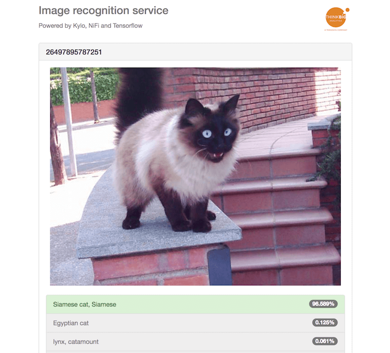

This project contains vagrant boxes based on the Kylo Sandbox to demonstrate various use-cases for Kylo/Nifi integrations

## Prerequisites

[VirtualBox](https://www.virtualbox.org/) and [Vagrant](http://www.vagrantup.com/) (minimum version 1.6)

## General information

These vagrant boxes are built on top of the Kylo Sandbox, for further details see also [https://kylo.io/quickstart.html](https://kylo.io/quickstart.html)

### Kylo Sandbox

> The Kylo Sandbox is a personal virtual environment so you can quickly get started with Kylo. The sandbox is a pre-configured Kylo instance with Apache Hadoop, Spark, and NiFi.

### Web services

These services should be available on every vagrant box provided by this project

* [Kylo](http://localhost:8400/) | http://localhost:8400
* [Apache Nifi](http://localhost:8079/nifi) | http://localhost:8079/nifi
* [Apache Ambari](http://localhost:8080/) | http://localhost:8080

### Access credentials

#### Kylo

* Administrator: dladmin/thinkbig
* Analyst: analyst/analyst
* Template designer: designer/designer
* Operator: operator/operator

#### Ambari

* Administrator: admin/admin

#### SSH

The most convenient way to access a box via ssh is by using vagrant

```
$ vagrant ssh
```

The default SSH port is forwarded to port 2222, the root user is using the credentials root/kylo

```
$ ssh root@localhost -p 2222
```

## Boxes

### Twitter streaming

Streaming tweets from the Twitter Streaming API to Solr and HDFS


[Details](example_twitter_streaming_solr/README.md)

#### Run it!

```
$ cd example_twitter_streaming_solr
$ vagrant up
```

### HTTP server and image recognition pipeline

A http server in a NiFi processor will propagate received images to a Tensorflow model which classifies the image and makes the results available via a web application 



[Details](example_http_server_and_pipeline/README.md)

#### Run it!

```
$ cd example_http_server_and_pipeline
$ vagrant up
```
