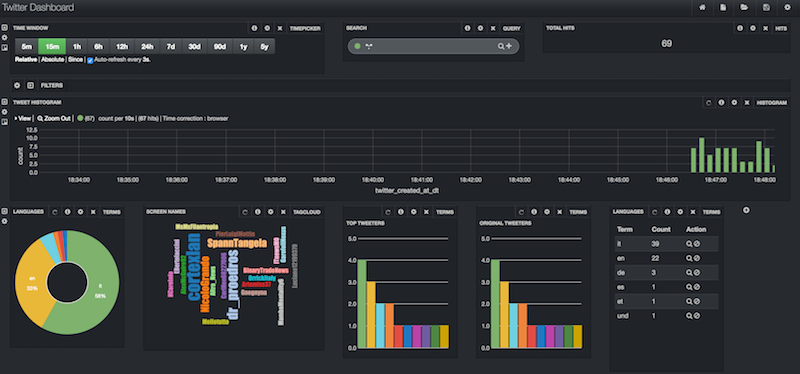

## General

Please see the for general instructions the [global README](../README.md)

## Twitter streaming to Solr

This example covers streaming http ingestion via the [Twitter hosebird client](https://github.com/twitter/hbc) and propagates data to Solr and HDFS. Also the data in Solr is visualized in a Banana dashboard.

## Additional web services

* [Solr](http://localhost:8983/solr/) | http://localhost:8983/solr
* [Banana](http://localhost:8983/solr/banana/index.html#/dashboard) | http://localhost:8983/solr/banana/index.html#/dashboard